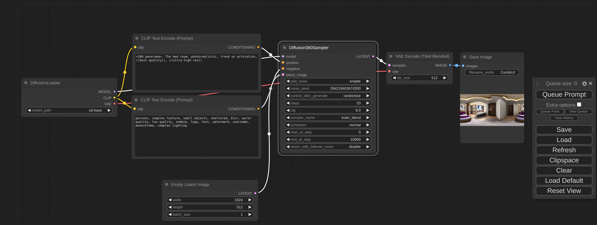

# Diffusion360_ComfyUI
ComfyUI plugin of https://github.com/ArcherFMY/SD-T2I-360PanoImage

## features
- [x] base t2i-pipeline for generating 512*1024 panorama image from text input
- [ ] SR-pipeline for higher-resolution panorama image generation

## Installation
1. Install ComfyUI following https://github.com/comfyanonymous/ComfyUI
2. Install this plugin by the following commands.
   ```
   cd ComfyUI/custom_nodes
   git clone https://github.com/ArcherFMY/Diffusion360_ComfyUI
   ```

## Usage
add 'Diffusion360Sampler' and 'VAE Decode (Tiled Blended)' from 'Diffusion360' category, and the pipeline looks like

   
